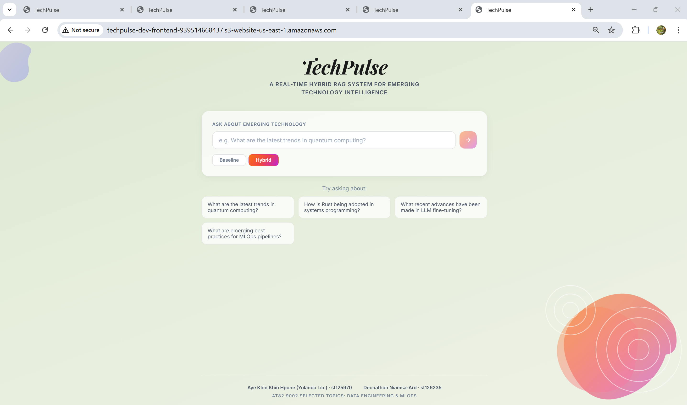
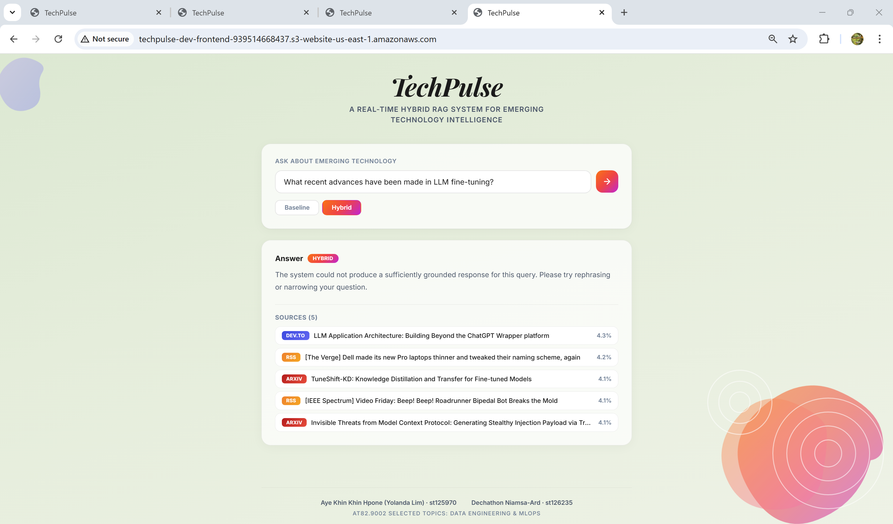
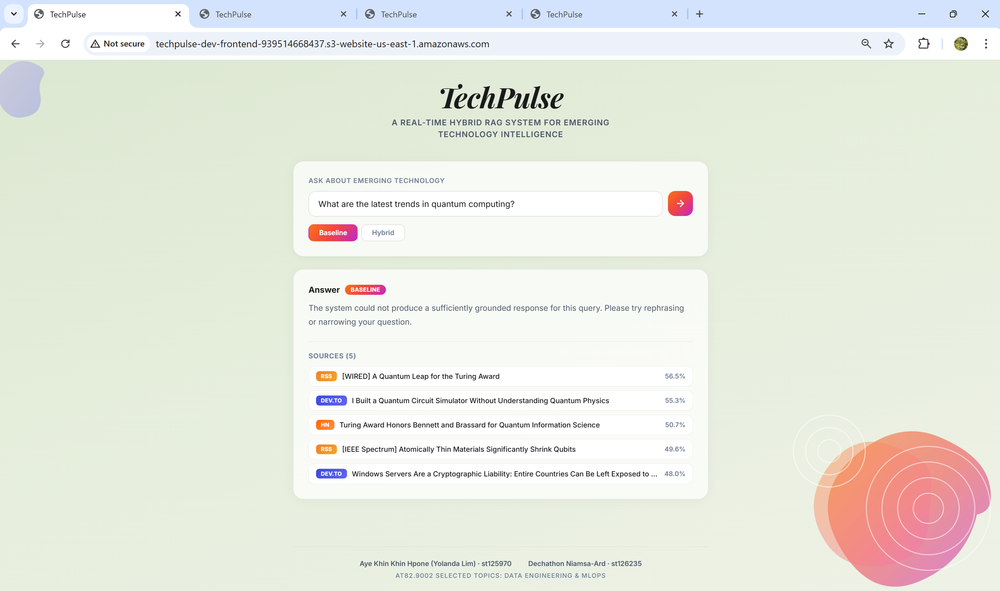
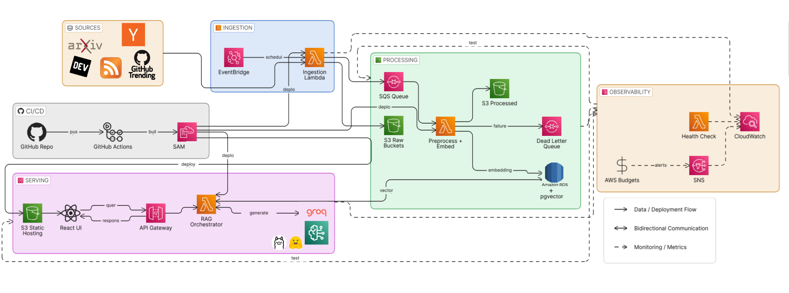

<div align="center">

# TechPulse

### A Real-Time Hybrid RAG System for Emerging Technology Intelligence

[](https://python.org)
[](https://fastapi.tiangolo.com)
[](https://react.dev)
[](https://www.postgresql.org)
[](https://aws.amazon.com/serverless/sam/)
[](https://docs.docker.com/compose/)
[](tests/)
[](tests/)

---

**AT82.9002** Selected Topic: Data Engineering and MLOps — Asian Institute of Technology, 2026

| Name | Student ID |
|:-----|:-----------|
| Aye Khin Khin Hpone (Yolanda Lim) | st125970 |
| Dechathon Niamsa-Ard | st126235 |

</div>

---

## Table of Contents

- [TechPulse](#techpulse)
    - [A Real-Time Hybrid RAG System for Emerging Technology Intelligence](#a-real-time-hybrid-rag-system-for-emerging-technology-intelligence)
  - [Table of Contents](#table-of-contents)
  - [Overview](#overview)
    - [Data Sources](#data-sources)
    - [Key Features](#key-features)
    - [Retrieval Fusion (RRF)](#retrieval-fusion-rrf)
  - [Screenshots](#screenshots)
  - [Architecture](#architecture)
    - [Local (Docker Compose)](#local-docker-compose)
    - [Pipeline Flow](#pipeline-flow)
    - [AWS Architecture (Free Tier)](#aws-architecture-free-tier)
  - [Quick Start (Local)](#quick-start-local)
    - [Prerequisites](#prerequisites)
    - [1. Start all services](#1-start-all-services)
    - [2. Use the app](#2-use-the-app)
    - [3. Query via API](#3-query-via-api)
  - [AWS Deployment (Free Tier)](#aws-deployment-free-tier)
    - [Required GitHub Secrets](#required-github-secrets)
    - [CI/CD Pipeline](#cicd-pipeline)
    - [After Deploy](#after-deploy)
  - [Local Development (without Docker)](#local-development-without-docker)
  - [Project Structure](#project-structure)
  - [Configuration](#configuration)
  - [Evaluation](#evaluation)
  - [Tests \& CI](#tests--ci)
  - [Roadmap](#roadmap)
    - [Completed](#completed)
    - [Remaining](#remaining)

---

## 🚀 Live Deployment

**Frontend:** [TechPulse Live Demo](http://techpulse-dev-frontend-939514668437.s3-website-us-east-1.amazonaws.com/)

Try the system live on AWS S3 + Lambda (Free Tier deployment)

---

TechPulse is a Hybrid RAG system that continuously ingests emerging technology content from **five data sources**, embeds it into a pgvector-powered PostgreSQL database, and serves grounded, citation-backed answers through a React frontend.

The system **runs locally via Docker Compose** and is **deployed to AWS via GitHub Actions + SAM** (ECR container images, RDS PostgreSQL, Lambda, API Gateway, EventBridge, S3, SQS, CloudWatch).

### Data Sources

| Source | Type | Frequency (local) | Content |
|:-------|:-----|:-------------------|:--------|
| ArXiv API | Scholarly | Every 12 hours | AI/ML/NLP research papers |
| Hacker News API | Industry signal | Every 30 minutes | Trending tech discussions |
| DEV.to API | Practitioner | Every 30 minutes | Developer blog articles |
| GitHub Trending | Open-source | Every 30 minutes | Trending repos + README |
| RSS Feeds | Tech news | Every 30 minutes | TechCrunch, Ars Technica, The Verge, IEEE Spectrum, etc. |

> On AWS, a single EventBridge rule triggers the ingestion Lambda every **6 hours**, executing all five sources in one invocation.

### Key Features

<table>
<tr><td>

**Ingestion & Processing**
- SHA-256 content-addressed deduplication
- S3 medallion data lake (raw / processed / embeddings)
- SQS-decoupled pipeline (async produce / consume)
- 4-state document lifecycle: RAW → PROCESSED → EMBEDDED → INDEXED
- HTTP retry with back-off (3 retries on 429/5xx)

</td><td>

**Retrieval & Ranking**
- MiniLM semantic embeddings (all-MiniLM-L6-v2, 384-dim, ONNX)
- HNSW vector index for fast ANN search
- 4-stage hybrid retrieval: metadata filter → vector + BM25 → RRF fusion
- Reciprocal Rank Fusion (RRF, K=60) — parameter-free, scale-invariant
- Source-type filtering on `/ask`

</td></tr>
<tr><td>

**Generation & Safety**
- Multi-backend LLM fallback: Groq → Bedrock → Ollama → HuggingFace
- LLM retry with exponential backoff (4 retries, 3s base)
- 3-layer hallucination verification
- Structured `[Source N]` citations with grounding check
- Budget guard — halts when monthly spend ≥ threshold

</td><td>

**Ops & Observability**
- Container-image Lambda (up to 10 GB via ECR)
- CloudWatch custom metrics + 3 alarms
- Deep health checks (DB, S3, SQS, LLM)
- Retrieval quality drift detection (dual-criteria: 10% threshold + Shewhart 3σ)
- Per-query token & cost tracking via tiktoken
- API rate limiting (10 req/min per IP)
- Connection pooling (1–25 connections)

</td></tr>
</table>

### Retrieval Fusion (RRF)

The hybrid retrieval pipeline fuses three independent ranking signals using **Reciprocal Rank Fusion** (Cormack et al., SIGIR 2009):

```
RRF(d) = Σ  1 / (K + rank_r(d))    for r ∈ {vector, BM25, recency}
```

> `K = 60` (standard constant). RRF is **parameter-free** and **scale-invariant** — no weight tuning required.
>
> _An earlier design-phase weighted formula (α/β/γ) was superseded due to dataset-dependent weights and p95 ≈ 25 s tail latency._

---

## Screenshots

<div align="center">

**Overview Page**



**Hybrid Retrieval** (left) vs **Baseline Retrieval** (right)

<p>


</p>

</div>

---

## Architecture

### Local (Docker Compose)

```
┌─────────────────────────────────────────────────────────────────────────────────┐
│                              Docker Compose (local)                             │
│                                                                                 │
│  ┌──────────┐  ┌──────────┐  ┌──────────┐  ┌──────────┐  ┌───────┐  ┌────────┐│
│  │PostgreSQL│  │ pgAdmin  │  │ FastAPI  │  │  React   │  │Schedu-│  │Local-  ││
│  │+pgvector │  │   GUI    │  │   API    │  │ Frontend │  │ ler   │  │Stack   ││
│  │  :5432   │  │  :5050   │  │  :8000   │  │  :3000   │  │       │  │ :4566  ││
│  └──────────┘  └──────────┘  └──────────┘  └──────────┘  └───────┘  └────────┘│
└─────────────────────────────────────────────────────────────────────────────────┘
```

### Pipeline Flow

```
Sources (ArXiv, HN, DEV.to, GitHub, RSS)
    │
    ▼
Ingestion (fetch + SHA-256 dedup → DB + S3 raw tier + SQS message)
    │
    ├──── SQS Queue (decouples ingestion from embedding)
    │
    ▼
Pipeline (normalise → chunk [RAW→PROCESSED] → MiniLM embed [→EMBEDDED] → S3 + DB [→INDEXED])
    │
    ▼
Retrieval (metadata filter → vector + BM25 → RRF fusion → top-k)
    │
    ▼
RAG Orchestrator (budget guard → build context → structured prompt → LLM [retry] → hallucination check → token cost)
    │
    ▼
FastAPI (/ask + /health + /drift) → CloudWatch metrics → React Frontend
```

### AWS Architecture (Free Tier)

```
┌─────────────┐     ┌────────────────┐     ┌──────────────────┐
│  EventBridge │────▶│  Ingestion λ   │────▶│  S3 (medallion)  │
│  (6-hour)    │     │  (5 sources)   │     │  raw/<source>/   │
└─────────────┘     └────────┬───────┘     │  processed/      │
                             │             └──────────────────┘
                             ▼
                     ┌───────────────┐
                     │   SQS Queue   │──DLQ──▶ Dead Letter Queue
                     └───────┬───────┘
                             ▼
                     ┌───────────────┐     ┌───────────────────────┐
                     │ Preprocess λ  │────▶│ RDS PostgreSQL 16      │
                     │ (chunk+embed) │     │ db.t3.micro + pgvector │
                     └───────────────┘     └────────┬──────────────┘
                                                    │
┌──────────────┐     ┌───────────────┐              │
│  React SPA   │────▶│ API Gateway   │────▶┌────────▼──────────┐
│  (S3 hosted) │     │ (HTTP API)    │     │  RAG API λ        │
└──────────────┘     └───────────────┘     │  (ECR container)   │
                                           │  Groq / Bedrock    │
                                           └───────────────────┘
CloudWatch alarms ─── SNS alerts
```



---

## Quick Start (Local)

### Prerequisites

- Docker & Docker Compose
- (Optional) [Ollama](https://ollama.ai) running locally for LLM generation

### 1. Start all services

```bash
docker compose up -d
```

This launches **6 containers**:

| Container | Port | Purpose |
|:----------|:-----|:--------|
| `techpulse-db` | 5432 | PostgreSQL 16 + pgvector |
| `techpulse-pgadmin` | 5050 | Database GUI |
| `techpulse-localstack` | 4566 | Local S3 + SQS (AWS emulation) |
| `techpulse-api` | 8000 | FastAPI backend (`/health`, `/ask`) |
| `techpulse-frontend` | 3000 | React UI (nginx) |
| `techpulse-scheduler` | — | Continuous ingestion + chunking + embedding |

> The **scheduler** automatically initialises the database schema on first run, then fetches data from all 5 sources on a loop.

### 2. Use the app

| Service | URL |
|:--------|:----|
| Frontend | http://localhost:3000 |
| API Swagger | http://localhost:8000/docs |
| pgAdmin | http://localhost:5050 (login `admin@techpulse.dev` / `admin`) |

### 3. Query via API

```bash
# Health check
curl http://localhost:8000/health

# Ask a question (hybrid mode)
curl -X POST http://localhost:8000/ask \
  -H "Content-Type: application/json" \
  -d '{"query": "What are recent approaches to efficient transformer architectures?", "mode": "hybrid"}'
```

---

## AWS Deployment (Free Tier)

Deployment is fully automated via **GitHub Actions** on every push to `main`.

### Required GitHub Secrets

Go to your repo → **Settings → Environments → dev → Secrets** and add:

<details>
<summary><strong>Required secrets</strong></summary>

| Secret | Where to find it | Notes |
|:-------|:-----------------|:------|
| `AWS_ACCESS_KEY_ID` | IAM → Users → Security credentials | Permanent |
| `AWS_SECRET_ACCESS_KEY` | Same as above | Permanent |
| `DB_USERNAME` | Your choice | e.g. `postgres` |
| `DB_PASSWORD` | Your choice | Min 8 characters |
| `GROQ_API_KEY` | [console.groq.com/keys](https://console.groq.com/keys) | Starts with `gsk_...` — **required** (primary LLM) |
| `DEFAULT_VPC_ID` | VPC → Your VPCs | e.g. `vpc-xxxxxxxx` |
| `DEFAULT_SUBNET_A` | VPC → Subnets | Any public subnet |
| `DEFAULT_SUBNET_B` | VPC → Subnets | Different AZ from A |
| `ALERT_EMAIL` | Your email address | SNS alert notifications |

</details>

<details>
<summary><strong>Optional secrets</strong></summary>

| Secret | Notes |
|:-------|:------|
| `GROQ_MODEL_ID` | Defaults to `llama-3.1-8b-instant` |
| `HF_API_TOKEN` | Only needed if `LLM_BACKEND=huggingface` |
| `DB_ALLOWED_CIDR` | Your IP (e.g. `203.150.1.2/32`); defaults to `0.0.0.0/0` |

> `AWS_SESSION_TOKEN` is **not required** for Free Tier personal accounts.

</details>

### CI/CD Pipeline

```
push to main
    │
    ├── Stage 1 (parallel):
    │   ├── lint-and-test
    │   │   ├── ruff check src/ tests/
    │   │   └── pytest --cov=src --cov-fail-under=60
    │   └── sam-validate
    │       ├── sam validate infra/template-freetier.yaml
    │       └── sam validate infra/template.yaml
    │
    ├── Stage 2 (main branch only):
    │   └── sam-deploy:
    │       ├── Create ECR repo (idempotent)
    │       ├── ECR login
    │       ├── docker build -f Dockerfile.lambda → push (tagged with git SHA)
    │       └── sam deploy --parameter-overrides ECRImageUri=<image> LLMBackend=groq ...
    │
    └── Stage 2b (after SAM deploy):
        └── build-frontend:
            ├── Fetch ApiUrl from CloudFormation outputs
            ├── npm ci → VITE_API_URL=$ApiUrl npm run build
            └── aws s3 sync dist/ → S3 static website
```

> **Why container images?** `fastembed` depends on `onnxruntime` (~150–200 MB on Linux x86_64),
> which pushes zip deployments past Lambda's 250 MB unzipped limit. Container images support up
> to 10 GB, solving this entirely.

### After Deploy

Find your live URLs in AWS Console → **CloudFormation → `techpulse-dev` → Outputs**:

| Output | Description |
|:-------|:------------|
| `ApiUrl` | Backend API endpoint |
| `FrontendUrl` | React frontend (S3 static website) |
| `PostgresEndpoint` | RDS database host |

> **Trigger first ingestion manually** (don't wait 6 hours):
> AWS Console → Lambda → `techpulse-dev-ingestion` → Test → send `{}`

---

## Local Development (without Docker)

```bash
python -m venv .venv
source .venv/bin/activate        # Linux / Mac
# .venv\Scripts\activate         # Windows
pip install -r requirements.txt
```

```bash
python -m src.db.init_schema        # Create tables
python -m src.ingestion.hn_ingester # Fetch HN stories
python -m src.pipeline.run_pipeline # Chunk + embed RAW docs
uvicorn src.api.main:app --reload   # Start API on :8000
```

---

## Project Structure

<details>
<summary>Click to expand full tree</summary>

```
data-pipeline/
├── docker-compose.yml                # 6 services: db, pgadmin, localstack, api, frontend, scheduler
├── Dockerfile                        # Python image for api + scheduler (local Docker Compose)
├── Dockerfile.lambda                 # Lambda container image (ECR) — bypasses 250 MB zip limit
├── requirements.txt
├── requirements-lambda.txt           # Lightweight deps for Lambda (fastembed, psycopg2, fastapi, etc.)
├── .github/workflows/ci.yml          # GitHub Actions CI/CD (lint → test → ECR build/push → SAM deploy)
│
├── src/
│   ├── config.py                     # Centralised env-var settings (DB, AWS, S3, SQS, CW)
│   ├── scheduler.py                  # Continuous ingestion loop (SQS consumer or DB-poll)
│   ├── api/
│   │   └── main.py                   # FastAPI app (/health, /ask, /drift) + Lambda handlers
│   ├── db/
│   │   ├── connection.py             # ThreadedConnectionPool + pgvector adapter
│   │   └── init_schema.py            # Schema: documents + chunks + drift_baselines + HNSW index
│   ├── ingestion/
│   │   ├── _http.py                  # Shared requests.Session with retry/back-off
│   │   ├── arxiv_ingester.py
│   │   ├── hn_ingester.py
│   │   ├── devto_ingester.py
│   │   ├── github_ingester.py
│   │   └── rss_ingester.py
│   ├── preprocessing/
│   │   └── chunker.py                # Text normalisation + tiktoken chunking
│   ├── embedding/
│   │   └── embedder.py               # fastembed all-MiniLM-L6-v2 (384-dim, ONNX Runtime)
│   ├── storage/
│   │   └── __init__.py               # S3 medallion layer (raw/processed/embeddings)
│   ├── queue/
│   │   └── __init__.py               # SQS producer/consumer
│   ├── observability/
│   │   ├── __init__.py               # CloudWatch metrics + deep health checks
│   │   └── drift.py                  # Retrieval quality drift detection
│   ├── pipeline/
│   │   └── run_pipeline.py           # RAW → PROCESSED → EMBEDDED → INDEXED
│   ├── retrieval/
│   │   └── retriever.py              # Baseline (vector-only) + Hybrid (4-stage, BM25 + RRF fusion)
│   └── orchestrator/
│       ├── rag.py                    # Retrieve → prompt → generate → hallucination check
│       └── llm_backends.py           # Groq / Bedrock / HuggingFace / Ollama — fallback chain router
│
├── frontend/
│   ├── Dockerfile                    # Multi-stage: node build → nginx serve
│   ├── nginx.conf                    # SPA routing + /api/ proxy to backend
│   ├── package.json                  # Vite + React 19
│   └── src/
│       ├── App.jsx
│       └── App.css
│
├── evaluation/
│   ├── run_eval.py                   # 9-phase evaluation pipeline
│   └── queries/
│       ├── eval_queries.json         # 50 queries (3 categories)
│       └── probe_queries.json        # 20 probe queries for drift detection
│
├── tests/                            # 204 tests · 15 modules · 60%+ coverage
│   ├── test_api.py          test_ingestion.py      test_queue.py
│   ├── test_db.py           test_llm_backends.py   test_rag.py
│   ├── test_embedder.py     test_observability.py  test_retriever.py
│   ├── test_http.py         test_pipeline.py       test_scheduler.py
│   │                        test_preprocessing.py  test_storage.py
│   └──                                             test_sync_to_aws.py
│
└── infra/
    ├── template-freetier.yaml        # SAM — Free Tier (container images, RDS db.t3.micro)
    ├── template.yaml                 # SAM — production reference (Aurora Serverless v2)
    ├── samconfig-freetier.toml
    └── README.md
```

</details>

---

## Configuration

All settings via environment variables (`.env` or Docker Compose `environment` block):

<details>
<summary><strong>Database</strong></summary>

| Variable | Default | Description |
|:---------|:--------|:------------|
| `DB_HOST` | `localhost` | PostgreSQL host (`db` in Docker) |
| `DB_PORT` | `5432` | PostgreSQL port |
| `DB_NAME` | `techpulse` | Database name |
| `DB_USER` | `postgres` | Database user |
| `DB_PASSWORD` | *(required)* | Database password |

</details>

<details>
<summary><strong>LLM Backends</strong></summary>

| Variable | Default | Description |
|:---------|:--------|:------------|
| `LLM_BACKEND` | `ollama` | `ollama` (local) / `groq` (AWS) / `bedrock` / `huggingface` |
| `OLLAMA_BASE_URL` | `http://localhost:11434` | Ollama endpoint |
| `OLLAMA_MODEL` | `llama3.2:3b` | Ollama model for generation |
| `GROQ_API_KEY` | — | Groq API key (required when `LLM_BACKEND=groq`) |
| `GROQ_MODEL_ID` | `llama-3.1-8b-instant` | Groq model ID |
| `GROQ_EVAL_MODEL_ID` | `llama-3.3-70b-versatile` | Larger Groq model used as RAGAS judge |
| `BEDROCK_MODEL_ID` | `amazon.nova-micro-v1:0` | Any model supported by Converse API |
| `HF_API_TOKEN` | — | HuggingFace API token |
| `HF_MODEL_ID` | `mistralai/Mistral-7B-Instruct-v0.2` | HuggingFace model ID |
| `LLM_MAX_TOKENS` | `300` | Max tokens for LLM generation |

</details>

<details>
<summary><strong>Retrieval & Reranking</strong></summary>

| Variable | Default | Description |
|:---------|:--------|:------------|
| `TOP_K` | `5` | Number of retrieval results |
| `CHUNK_SIZE_TOKENS` | `500` | Tokens per chunk |
| `CHUNK_OVERLAP_TOKENS` | `50` | Overlap between chunks |
| `RERANK_ALPHA` | `0.70` | _(Legacy, superseded by RRF)_ Cosine similarity weight |
| `RERANK_BETA` | `0.15` | _(Legacy, superseded by RRF)_ Keyword overlap weight |
| `RERANK_GAMMA` | `0.15` | _(Legacy, superseded by RRF)_ Recency decay weight |
| `RECENCY_LAMBDA` | `0.01` | _(Legacy, superseded by RRF)_ Exponential decay rate |

</details>

<details>
<summary><strong>AWS & Infrastructure</strong></summary>

| Variable | Default | Description |
|:---------|:--------|:------------|
| `S3_ENABLED` | `false` | Enable S3 medallion data lake |
| `S3_BUCKET_NAME` | `techpulse-data` | S3 bucket name |
| `SQS_ENABLED` | `false` | Enable SQS ingestion queue |
| `SQS_QUEUE_URL` | — | SQS queue URL |
| `CLOUDWATCH_ENABLED` | `false` | Enable CloudWatch metric publishing |
| `CITATION_GROUNDING_THRESHOLD` | `0.0` | Min citation ratio before flagging |
| `BUDGET_HALT_ENABLED` | `false` | Enable budget guard (`true` on AWS) |
| `MONTHLY_BUDGET_USD` | `15` | Monthly cost threshold |
| `ALLOWED_ORIGINS` | `*` | Comma-separated CORS origins |
| `STAGE` | `dev` | CloudWatch namespace suffix (`TechPulse/<stage>`) |

</details>

---

## Evaluation

The evaluation framework implements a **9-phase pipeline** comparing **baseline (vector-only)** vs **hybrid retrieval**:

| Phase | Name | Description |
|:-----:|:-----|:------------|
| 1 | RAG Query Execution | 50 queries × 2 modes (baseline + hybrid) with per-query latency |
| 2 | RAGAS LLM-Judged Scoring | Faithfulness, answer relevancy, context precision |
| 3 | Summary Statistics | Mean, median, p95, citation grounding, token costs per mode |
| 4 | Grid Search _(design-phase, superseded by RRF)_ | α ∈ {0.4, 0.5, 0.6, 0.7}, β=γ=(1−α)/2 — motivated the switch to RRF |
| 5 | Sensitivity Analysis _(design-phase, superseded by RRF)_ | One-at-a-time sweep of α, β, γ — documented the fragility of weighted scoring |
| 6 | Statistical Tests | Wilcoxon signed-rank, Cohen's d effect size, bootstrap 95% CI |
| 7 | Drift Validation | 4 simulated scenarios (normal → Shewhart breach → catastrophic) |
| 8 | Composite Metric | 0.35×Faithfulness + 0.25×Relevancy + 0.20×Precision + 0.20×CitationGrounding |
| 9 | Cost Projection | Monthly cost for 50/100/200 queries/day vs free-tier ceilings |

```bash
python -m evaluation.run_eval
```

Results are written to `evaluation/results/` as JSON.

---

## Tests & CI

```bash
ruff check src/ tests/                                          # lint
pytest tests/ -v --cov=src --cov-report=term-missing           # unit tests + coverage
```

> CI enforces a **minimum 60% coverage** threshold — the build fails if coverage drops below this.

---

## Roadmap

### Completed

- [x] 5-source data ingestion pipeline (ArXiv, HN, DEV.to, GitHub, RSS) with SHA-256 deduplication
- [x] Token-based chunking + fastembed MiniLM embedding (ONNX — no PyTorch)
- [x] Hybrid retrieval with 4-stage BM25+RRF fusion (parameter-free)
- [x] Multi-backend LLM fallback chain (Groq → Bedrock → Ollama → HuggingFace)
- [x] FastAPI backend (`/health`, `/ask`, `/drift`) + React frontend (Vite)
- [x] Docker Compose (6 services) + container-image Lambda deployment via ECR
- [x] S3 medallion data lake + SQS-decoupled ingestion pipeline
- [x] 3-layer hallucination verification + retrieval quality drift detection
- [x] CloudWatch custom metrics + deep health checks + 3 alarms
- [x] RAGAS evaluation framework (50 queries, 9-phase pipeline, statistical tests)
- [x] AWS IaC via SAM (Free Tier + production templates)
- [x] GitHub Actions CI/CD — lint → test → SAM validate → deploy → S3 frontend upload
- [x] 204 unit tests across 15 modules (60%+ coverage gate)

### Remaining

- [ ] Migrate local data to AWS RDS after first deploy
- [ ] RAGAS evaluation run on live AWS deployment
- [ ] Source diversity analysis — investigate and mitigate corpus skew toward any single source
- [ ] CloudFront HTTPS — add CloudFront distribution for S3 frontend
